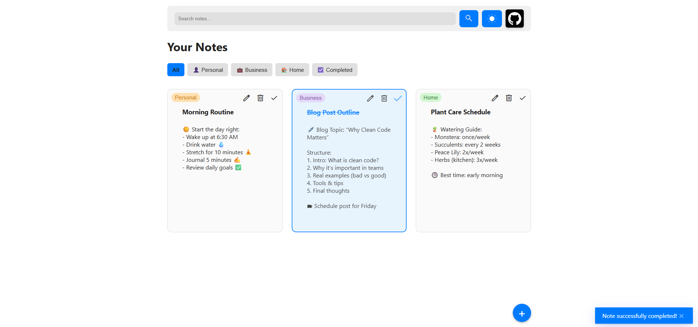
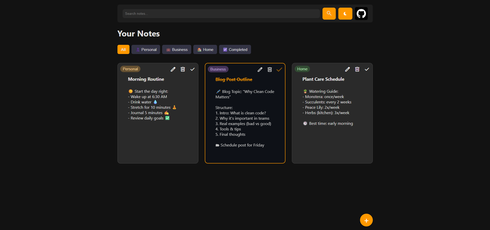

# 📝 Notes App

A clean, responsive Notes App built with HTML, CSS, and JavaScript. Easily create, edit, and organize notes by folders. Great for personal productivity, planning, and daily organization.

## 🟢 Live Demo

👉 [Click here to try the Notes App live](https://DenysHandziichuk.github.io/Notes-App/)

## 🔧 Features

- 🗂 Organize notes into folders (Work, Personal, Home, Completed)
- 📝 Create and edit notes using a simple modal interface
- ✅ Mark notes as completed
- ✨ Clean, responsive UI with hover animations
- 📁 Filter notes by folder
- 💾 (Optional) Add LocalStorage to save notes between sessions

## 📸 Screenshots

#### 🖼️ All Notes View  

#### 🗂️ Folder Filter & Modal  

